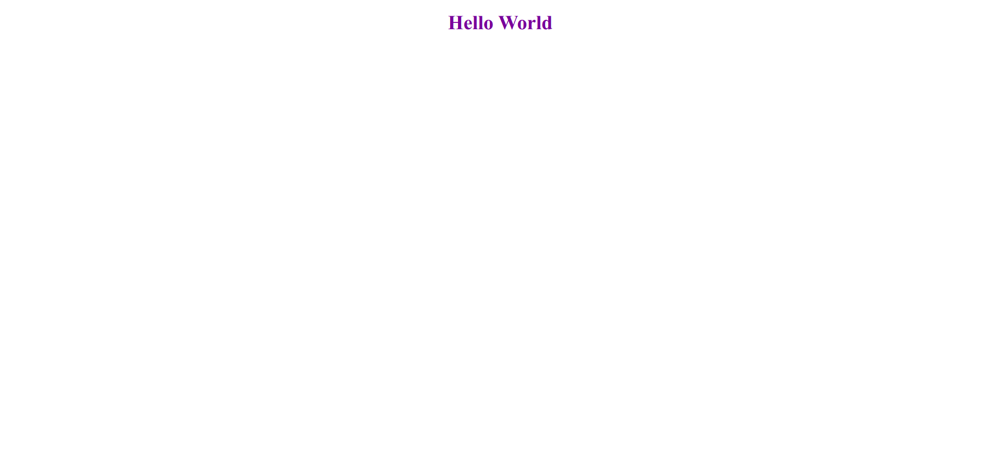

# Hello World

> One paragraph statement about the project.

This is the day 1 project on Microverse. A simple static website containing a header with the caption "Hello World".

## Built With

- Major languages
    -HTML
    -CSS

## Live Demo

[Live Demo Link](https://samroodali.github.io/hello-world/)

## Getting Started
for developers:
run npm install for stylelint and webhint

To get a local copy up and running follow these simple example steps.

### Prerequisites
nodejs and npm if you plan on developing and need the linters included in package.json file
## Authors

👤 **Author1**

- GitHub: [@githubhandle](https://github.com/SamroodAli)
- LinkedIn: [LinkedIn](https://www.linkedin.com/in/samrood-ali/)

## 🤝 Contributing

Contributions, issues, and feature requests are welcome!
Feel free to check the [issues page](issues/).

## Show your support

Give a ⭐️ if you like this project!

## Acknowledgments

- Microverse
- Ilie Babcenco
# hello-world
